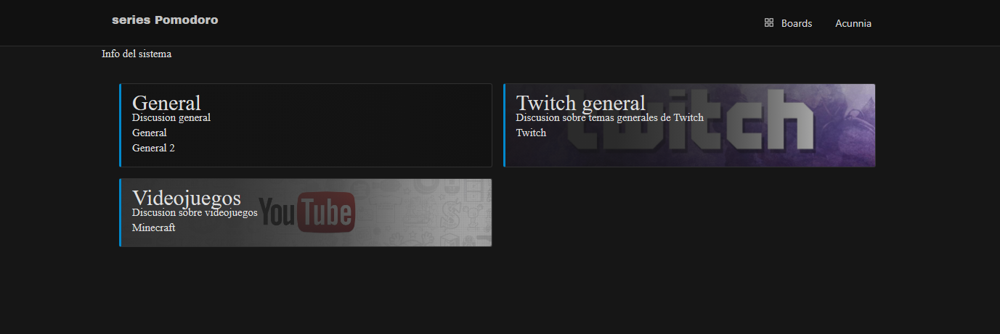

# seriesPomodoro

:star: Star us on GitHub — it motivates us a lot!

A forum app inspired in Lost-Ark Forums powered by MongoDB, Express, React + AntD and NodeJS

## Table of Contents

- [Installation](#installation)
    - [Pre-Requisites](#pre-requisites)
    - [Configuring](#configuring)
- [Known Issues](#known-issues)
- [Development](#development)

## Installation

This document is a step by step tutorial for a end-user

### Pre-Requisites

You should have installed and configured to use the following applications before start the installation:

* MongoDB
* Express
* NodeJS + NPM

### Configuring

Before starting the installation you need to configure the .env file

## KNOWN ISSUES
* Poblar la bbdd por primera vez al menos con los roles (web explota al registro si no lo tiene)

## Development

* La libreria de shortid no funciona, se ha buscado sustituta (nanoid), finalmente descartada porque añadia una capa extra de complejidad innecesaria, se usan los hash UUID que proporciona mongo como identificador unico de cada objeto

